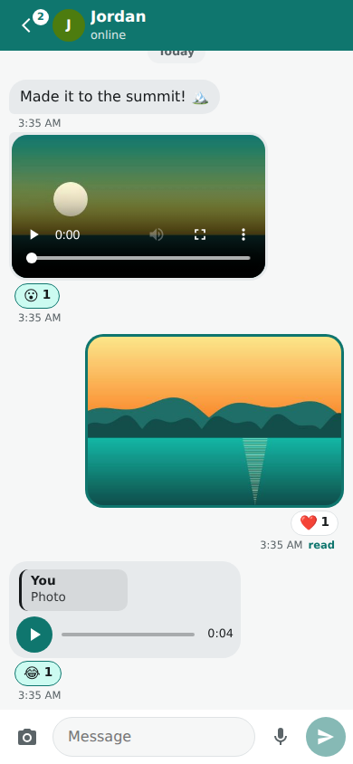
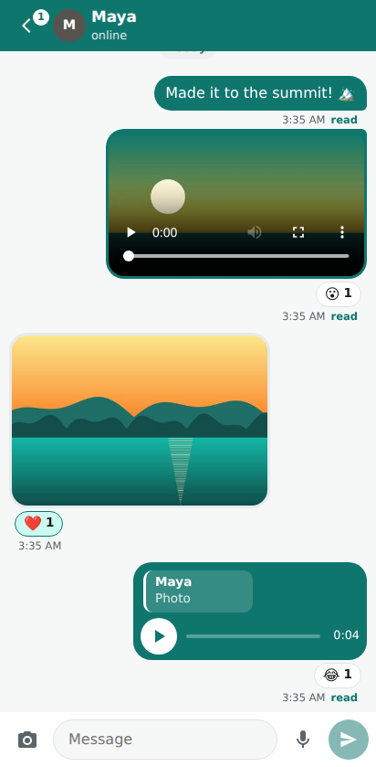
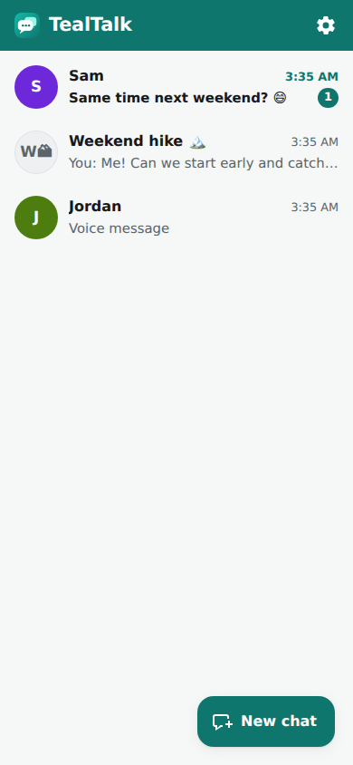
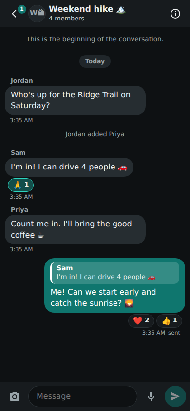

# TealTalk

**An ad-free messenger that works the same on Android and iPhone. Nobody is on blue.**

On most phones, who you can message and how well depends on which phone you and your friends bought. TealTalk ignores that. Everyone gets the same app, the same colours and the same features: read receipts, typing indicators, photos and group chats. Your messages are teal and everyone else's are grey, on every device.

- **No ads, no trackers, no analytics.** The app loads nothing from third parties: no CDNs, fonts or scripts from anyone else, backed by a strict Content-Security-Policy.
- **Android and iPhone:** TealTalk is a Progressive Web App. Open it in the browser and add it to your home screen. It runs full screen like a native app, starts offline and gets push notifications. No app store is needed.
- **You host it.** One small Node server with a single SQLite file. Your messages live on your server and nowhere else.

| iPhone (Maya) | Android (Jordan) | Chats | Dark mode |
| --- | --- | --- | --- |
|  |  |  |  |

The same conversation on both phones: your messages are teal and theirs are grey, whichever phone anyone uses.

## Features

- **Full-quality photos and videos**, both ways. Nothing is downscaled or "compressed for MMS". Large videos upload in resumable chunks, so a dropped signal doesn't start over. The GPS location is removed from photos before they leave your phone.
- **Voice messages** recorded in a format that plays on both iPhone and Android
- **Real reactions** that show as reactions on everyone's phone, plus replies, edit (15 min) and unsend (24 h)
- **Group chats that work across phones:** add people, rename, leave
- Read receipts and typing indicators for everyone
- 1:1 and group chats with real-time delivery over WebSocket
- Username + password accounts. No phone number or email needed; a signup code keeps strangers out.
- Push notifications on Android and on iPhone (iOS 16.4+, once the app is on the home screen)
- Works offline: the app shell is cached, and messages you write offline are queued and sent when you reconnect, without duplicates
- Dark mode, safe-area aware layout, large tap targets

## Run it

Requires Node 22.5 or later.

```sh
npm install
npm start                       # http://localhost:3000
PORT=8080 DATA_DIR=/srv/tealtalk npm start
```

| Env | Default | |
| --- | --- | --- |
| `PORT` | `3000` | HTTP and WebSocket port |
| `HOST` | `0.0.0.0` | bind address |
| `DATA_DIR` | `./data` | SQLite database, uploaded photos and the generated push keys |
| `VAPID_SUBJECT` | `mailto:admin@localhost` | contact address sent to push services |
| `TRUST_PROXY` | unset | set to `1` behind a reverse proxy so login rate limits use the real client IP |
| `SIGNUP_CODE` | unset | require this code to create an account. Set it on any public server |
| `MAX_UPLOAD_MB` | `250` | largest photo, video or voice message |
| `MEDIA_RETENTION_DAYS` | `0` (forever) | delete the server's copy of media after this many days, while phones keep theirs. The main hosting-cost lever |

### Put it on your phones

See [docs/DEPLOY.md](docs/DEPLOY.md). It starts with a free way to try TealTalk on your own phones: your computer plus a Cloudflare quick tunnel.

## Tests

```sh
npm test            # server integration tests
npm run test:e2e    # browser tests: an iPhone user and an Android user chatting, sending full-quality photos,
                    # videos and voice messages, reacting, replying and running a group (needs Playwright + Chromium)
```

## Known limitations (prototype)

- Messages are protected in transit by HTTPS and stored unencrypted on your server. There's no end-to-end encryption yet.
- The e2e test emulates the iPhone with Chromium's iPhone 13 profile. Real Safari on iOS has not been tested yet, particularly how the composer behaves when the keyboard opens.
- A photo or video still uploading is lost if the app is closed before it finishes. Queued text messages are kept.
- Real iPhone Safari behaviour still needs checking on a device: whether Safari's picker shrinks videos, AAC voice recording, and long-press menus.
- There is no password reset yet.

## How it's built

- `server/`: Node HTTP + WebSocket server (`ws`), `node:sqlite` storage, `web-push` for notifications
- `public/`: the PWA in plain HTML, CSS and ES modules, with no build step and no framework
- `docs/PROTOCOL.md`: the API, WebSocket events and UI test contract
- `docs/DEPLOY.md`: getting it online · `docs/SCALING.md`: growing to 1M users and paying for it without ads

## License

MIT
